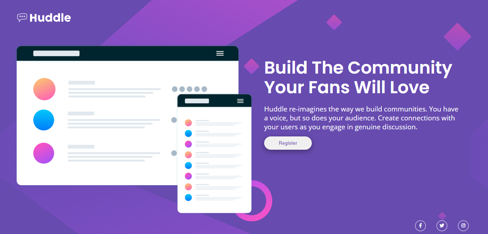
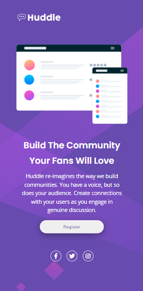

# Huddle Landing Page
Projeto [Huddle Landing Page](https://www.frontendmentor.io/challenges/huddle-landing-page-with-a-single-introductory-section-B_2Wvxgi0) do Frontend Mentor é o desafio para a Quest HTML + CSS Avançado do curso DevQuest.

# Prosposta do desafio
Fazer uma landing page de forma responsiva com o material do desafio "Huddle Landing Page" . 

# Imagens do projeto
## - Tela-Desktop:

## - Tela-mobile:

 

# Tecnologias utilizadas
- HTML
- CSS

# Links
- URL do repositório : 
https://github.com/deivid-rodrigues/Huddle-Landing-Page
 

- URL do Website:
https://deivid-rodrigues.github.io/Huddle-Landing-Page/